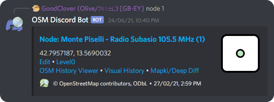

# OSM Discord Bot

[](https://results.pre-commit.ci/latest/github/GoodClover/OSM-Discord-bot/main)
[](https://merge-chance.info/target?repo=goodclover/OSM-Discord-bot)



## **Maintainance mode**

The code is messy, the libraries this bot uses have been deprecated.
Minor changes and bug-fixes will still be made.

If you come here with the goal of updating it, you might be better using [test 9's fork](<https://github.com/kallejre/OSM-Discord-bot>), with improved code organisation.
You probabbly want [interactions-py](<https://github.com/interactions-py/library>), the successor to what the current code uses.

## Features

For a full list of commands see [COMMANDS.md](COMMANDS.md), running `/help` will give you an interactive help system.
These are slash commands, so Discord will also tell you what the commands do and how to use them.

If they are enabled, the bot can show suggestions in a specific channel.

The bot also updates a member count upon someone joining/leaving the server.

Embedding of elements, map fragments, notes, users and changesets also works by putting the following somewhere in your message in addition to using the command, using the command enabled getting extra info though if it's wanted:

- `node/<ID>` (`way` and `relation` work too)
- `note/<ID>`
- `user/<username>`
- `changeset/<ID>`
- `map=#<Zoom>/<Lat>/<Lon>`


## HELP.md

This is Discord markdown, so many normal features are missing or work differently.
* A heading with one `#` creates a new page.
* To add an image paste its link on the line after the title. This line **must** be blank if no image is to be shown.
* Most links should be encased in `<>` to prevent Discord from showing an embed. e.g. `[Example](<https://example.com>)`
* Command signatures should be enclosed in triple ` ``` ` back-ticks. There should be no blank line after them.


## Configuration

### `config.json`

Most of the config lives here.
I can't be bothered to list it, so just look at the [sample config](sample_config.json) for now.

### `.env` file

Make a `.env` (nothing before the dot) containing:

```env
DISCORD_TOKEN=<bot-token>
TESTING=<False> or <True>
DISCORD_TESTING_TOKEN=<optional-testing-bot-token>
```

## License

[DBAD Public License](LICENSE.md)

(Look, I doubt anyone other than myself will ever use/host this code.
If you really don't like the license then message me for explicit permisson or something, I'll likely do it.)
